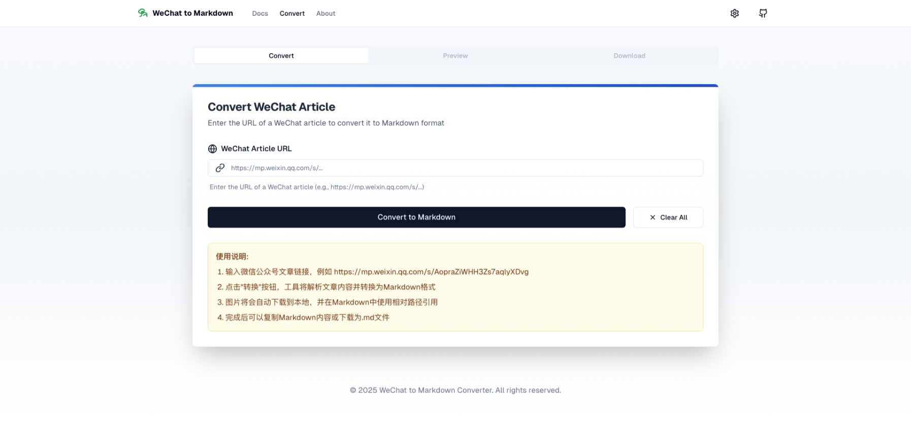

# 微信公众号文章转 Markdown 工具

一个现代化的网页应用，可将微信公众号文章转换为干净的 Markdown 格式，并支持图片处理。

[English](README.md) | 中文文档



## 功能特点

- 🔄 一键将微信公众号文章转换为干净的 Markdown
- 🖼️ 自动下载并处理文章中的图片
- 👁️ 实时预览转换后的 Markdown 内容
- 💾 提供仅下载 Markdown 文件或完整打包（含图片）的选项
- 🌓 支持亮色和暗色模式
- 📱 适配所有设备的响应式设计

## 使用指南

### 转换文章

1. **输入微信公众号文章 URL**
   - 粘贴微信公众号文章的 URL（例如：`https://mp.weixin.qq.com/s/...`）
   - URL 必须来自微信公众平台（`mp.weixin.qq.com` 或 `weixin.qq.com`）

2. **点击"转换为 Markdown"**
   - 应用将获取并处理文章内容
   - 进度指示器将显示转换状态

3. **查看转换后的内容**
   - 转换成功后，您将自动进入预览标签页
   - 您可以在渲染预览和原始 Markdown 源码之间切换

### 下载文件

1. **下载选项**
   - **Markdown 文件**：仅下载 Markdown 文件（.md）
   - **完整打包**：下载包含 Markdown 文件和所有图片的 ZIP 文件

2. **图片管理**
   - 文章中的所有图片都会被自动处理
   - 图片以唯一文件名保存在 "images" 文件夹中
   - 在 Markdown 文件中，图片使用相对路径引用（`./images/filename`）

### 获得最佳效果的提示

- 确保微信公众号文章 URL 是公开可访问的
- 对于包含大量图片的文章，转换可能需要更长时间
- 如果您在特定文章上遇到问题，请尝试清除浏览器缓存并重试

## 开发者入门指南

首先，克隆仓库：

```bash
git clone https://github.com/yourusername/wechat-to-markdown.git
cd wechat-to-markdown
```

安装依赖：

```bash
npm install
# 或
yarn install
# 或
pnpm install
```

运行开发服务器：

```bash
npm run dev
# 或
yarn dev
# 或
pnpm dev
```

在浏览器中打开 [http://localhost:3000](http://localhost:3000) 查看结果。

## 项目结构

```
wechat-to-markdown/
├── public/
│   └── placeholder.png
├── src/
│   ├── app/
│   │   ├── api/
│   │   │   ├── convert/
│   │   │   │   └── route.js
│   │   │   └── download/
│   │   │       └── route.js
│   │   ├── layout.tsx
│   │   └── page.tsx
│   ├── components/
│   │   ├── ui/ (shadcn components)
│   │   ├── converter-form.tsx
│   │   ├── markdown-preview.tsx
│   │   └── file-download.tsx
│   ├── lib/
│   │   ├── wechat-parser.js
│   │   └── markdown-converter.js
│   └── styles/
│       └── globals.css
├── .env
├── next.config.js
├── package.json
└── tailwind.config.js
```

## 使用的技术

- [Next.js](https://nextjs.org/) - React 框架
- [Tailwind CSS](https://tailwindcss.com/) - 实用优先的 CSS 框架
- [shadcn/ui](https://ui.shadcn.com/) - UI 组件库
- [Turndown](https://github.com/mixmark-io/turndown) - HTML 转 Markdown 转换器
- [Cheerio](https://cheerio.js.org/) - 快速、灵活的 HTML 解析器
- [JSZip](https://stuk.github.io/jszip/) - 用于创建 ZIP 文件的 JavaScript 库

## 许可证

本项目采用 MIT 许可证 - 详情请参阅 LICENSE 文件。

## 致谢

- 感谢微信平台提供丰富的内容
- 感谢所有使这个项目成为可能的开源库 